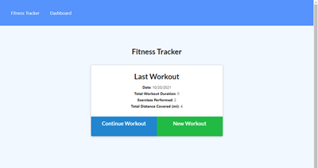

# Fitness Workout Tracker

Given some starter code, built out functionality to view create and track daily workouts. The user can also log multiple exercises in a workout on a given day as well as track the name, type, weight, sets, reps, and duration of exercise. If the exercise is a cardio exercise, the user can also track their distance traveled.

Our goal is to keep people on top of their fitness goals so that they stay in the "workout game" longer!    

  

## Access the tool here:
[Fitness Tracker Tool](https://polar-headland-51031.herokuapp.com/)

## How to use the tool

When the user loads the page, they are given the option to create a new workout or continue with their last workout.

The user then can:

  * Add exercises to the most recent workout plan.
  * Add new exercises to a new workout plan.
  * View the combined weight of multiple exercises from the past seven workouts on the `stats` page.
  * View the total duration of each workout from the past seven workouts on the `stats` page.

## Credits
Denver University for the starter frontend code.
Lee Macklin for the frontend enhancements and backend code.